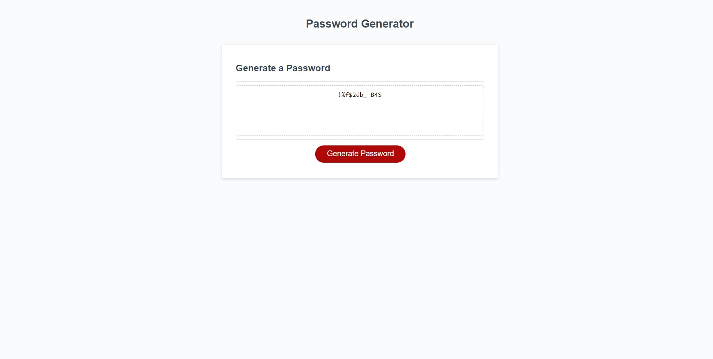

# Password Generator
Welcome to my Password Generator!

## Description
This website is designed to generate a random password for the user.

## Features
Click the 'Generate Password' button for a randomized password. When prompted, you will select your desired password length, and whether or not to include UPPERCASE or LOWERCASE letters, numbers, or special characters.

## Contributing

This website is deployed through GitHub. Click the link below to visit my repo page.

https://github.com/Daleray1231/password-gen 

## Footer
Starter code source:

https://github.com/coding-boot-camp/friendly-parakeet

The website was made by Dale Haynie.

## License

This project is licensed under the [MIT License](LICENSE).

